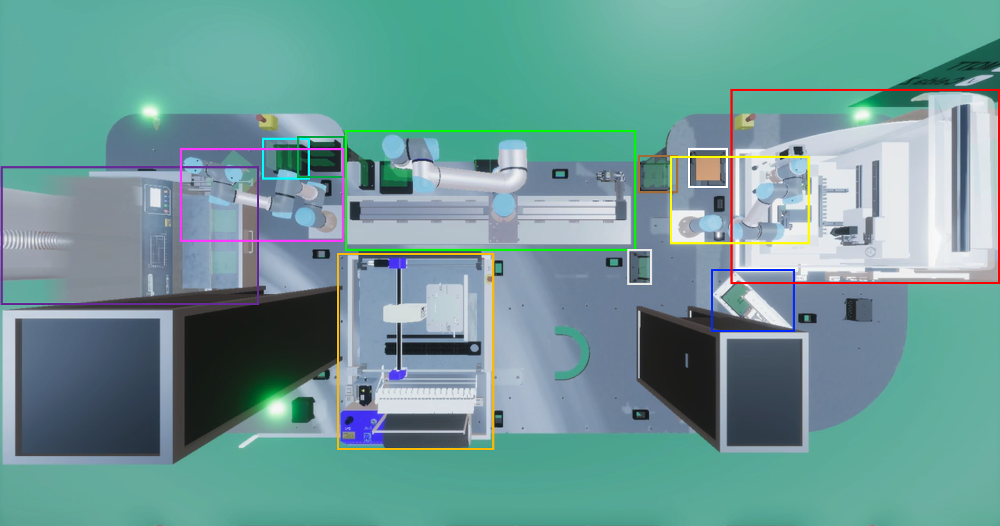

# Manufacturing cell: Object Detector using YOLOv8 neural network

<div align="center">
  <a>
    
  </a>
</div>


The source code for [this](https://dev.to/andreygermanov/a-practical-introduction-to-object-detection-with-yolov8-neural-network-3n8c) article.

This is a web interface to [YOLOv8 object detection neural network](https://ultralytics.com/yolov8) 
implemented on [Python](https://www.python.org) that uses a model to detect elements in images of a printed circuit board manufacturing cell.

## Install

* Clone this repository: `git clone https://github.com/trejoan1/elementdetection.git`
* Go to the root of cloned repository
* Install dependencies by running `pip3 install -r requirements.txt`

## Run

Execute:

```
python3 post_object_detector.py
```

It will start a webserver on http://localhost:8080. Use any web browser to open the web interface.

Using the interface you can upload the image to the object detector and see bounding boxes of all objects detected on it.
